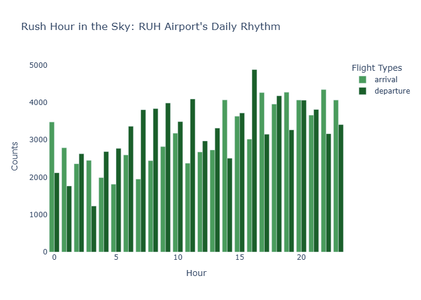
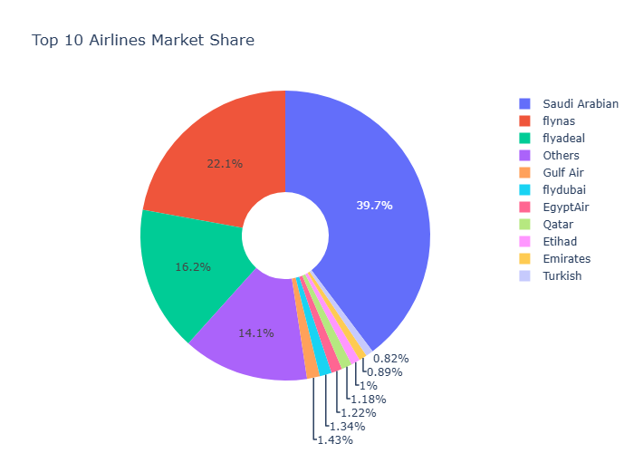

# ✈️ King Khalid Airport Flight Analytics


A comprehensive data analysis and machine learning project exploring **153,000+ flights** at King Khalid International Airport (RUH) in Riyadh, Saudi Arabia. This project demonstrates end-to-end data science skills including data cleaning, exploratory analysis, interactive visualization, geographic mapping, and predictive modeling.

<p align="center">
  
</p>

---

## 📊 Key Insights

| Finding | Insight |
|---------|---------|
| **Market Dominance** | Three Saudi carriers (Saudia, flynas, flyadeal) control **78%** of all traffic |
| **Peak Hours** | Departures peak at **4 PM**, arrivals dominate late evening (**10 PM**) |
| **Seasonality** | Summer months (July-September) are busiest, aligned with Hajj season |
| **Top Route** | Jeddah is the #1 destination with **28,000 flights** (religious travel hub) |
| **ML Accuracy** | Random Forest classifier achieves **98.85%** accuracy predicting domestic vs international flights |
| **Key Predictor** | Terminal assignment alone accounts for **88%** of prediction importance |

---

## 🗂️ Project Structure

```
King_Khalid_Airport_Flights_Analysis/
│
├── README.md                        # Project documentation
├── LICENSE                          # MIT License
├── requirements.txt                 # Python dependencies
├── Airport_flightsAnalysis.ipynb    # Main Jupyter notebook
├── dashboard.py                     # Interactive Dash application
├── flights_RUH.csv                  # Dataset
│
└── images/
    ├── hourly_distribution.png      # Departure vs arrival patterns
    ├── market_share.png             # Airline market share donut chart
    ├── feature_importance.png       # ML feature importance
    └── route_map.html               # Interactive Folium map
```

---

## 🔍 Analysis Overview

### 1. Data Cleaning & Preprocessing
- Handled `\N` null placeholders across multiple columns
- Parsed datetime columns and extracted temporal features (hour, day, month)
- Dropped high-missingness columns (aircraft registration, callSign)
- Corrected misspelled airport names (Neyran → Najran)

### 2. Exploratory Data Analysis
- Analyzed **153,308 flights** spanning March to October 2025
- Identified peak travel hours for departures vs arrivals
- Discovered seasonal patterns aligned with Saudi religious calendar
- Mapped airline market concentration

### 3. Interactive Visualizations

**Airline Market Share**



**Feature Importance (ML Model)**


### 4. Geographic Analysis
- Built interactive route map using Folium
- Visualized connectivity from Riyadh to 15+ destinations
- Classified routes as domestic (Saudi Arabia) vs international

### 5. Machine Learning
- **Task:** Binary classification (Domestic vs International flights)
- **Model:** Random Forest Classifier
- **Accuracy:** 98.85%
- **Key Finding:** Terminal assignment is the dominant predictor (88% importance), revealing operational segregation of flight types at RUH

---

## 🚀 Getting Started

### Prerequisites
```bash
Python 3.8+
pip install -r requirements.txt
```

### Installation

1. Clone the repository:
```bash
git clone https://github.com/M-AlAteegi/King_Khalid_Airport_Flights_Analysis.git
cd King_Khalid_Airport_Flights_Analysis
```

2. Install dependencies:
```bash
pip install -r requirements.txt
```

3. Run the Jupyter notebook:
```bash
jupyter notebook Airport_flightsAnalysis.ipynb
```

4. Launch the interactive dashboard:
```bash
python dashboard.py
```
Then open `http://127.0.0.1:8050/` in your browser.

---

## 🛠️ Technologies Used

| Category | Tools |
|----------|-------|
| **Data Manipulation** | Pandas, NumPy |
| **Visualization** | Plotly Express, Matplotlib |
| **Dashboard** | Dash |
| **Geographic Mapping** | Folium |
| **Machine Learning** | scikit-learn (Random Forest) |
| **Development** | Jupyter Notebook, VS Code |

---

## 📈 Model Performance

```
              precision    recall  f1-score   support

International       1.00      0.98      0.99     14743
     Domestic       0.98      1.00      0.99     15712

     accuracy                           0.99     30455
    macro avg       0.99      0.99      0.99     30455
 weighted avg       0.99      0.99      0.99     30455
```

**Confusion Matrix:**
|  | Predicted International | Predicted Domestic |
|--|------------------------|-------------------|
| **Actual International** | 14,406 ✓ | 337 ✗ |
| **Actual Domestic** | 13 ✗ | 15,699 ✓ |

---

## 📂 Dataset

**Source:** [King Khalid International Airport Flights Dataset](https://www.kaggle.com/datasets/mohammedalsubaie/king-khalid-international-airport-flights-dataset/data)

**Author:** Mohammed AlSubaie (Data Engineer)

**Description:** Flight schedule data from King Khalid International Airport (RUH) containing 153,000+ records with information on airlines, aircraft, destinations, terminals, and timestamps.

**Features include:**
- Flight number and airline information
- Aircraft model and registration
- Origin/destination airports with IATA/ICAO codes
- Scheduled times (UTC and local)
- Terminal assignments
- Flight status

---

## 🙏 Acknowledgments

- **Mohammed AlSubaie** for creating and sharing the dataset on Kaggle
- King Khalid International Airport (RUH) for being the subject of this analysis

---

## 📫 Contact

**Mohammed Al-Ateegi**

[](https://www.linkedin.com/in/mohammed-alateegi-2853b3248/)
[](https://github.com/M-AlAteegi)

---

## 📄 License

This project is licensed under the MIT License - see the [LICENSE](LICENSE) file for details.

---

<p align="center">
  <i>If you found this project useful, please consider giving it a ⭐!</i>
</p>
